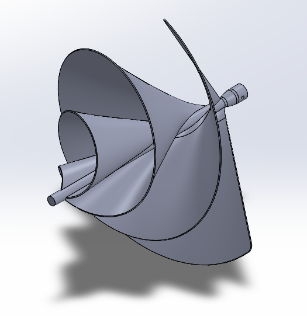
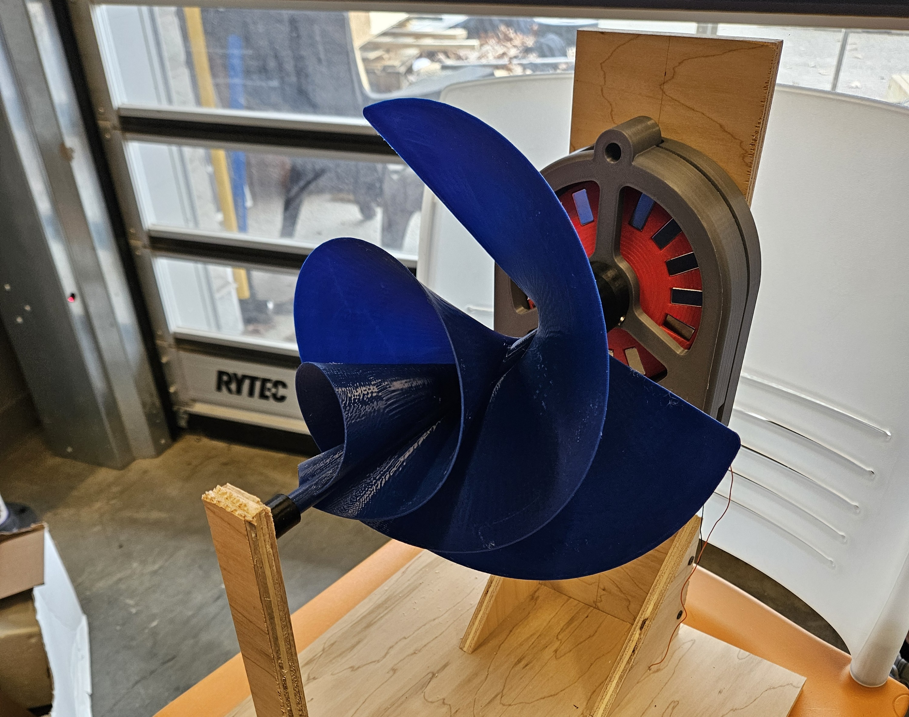
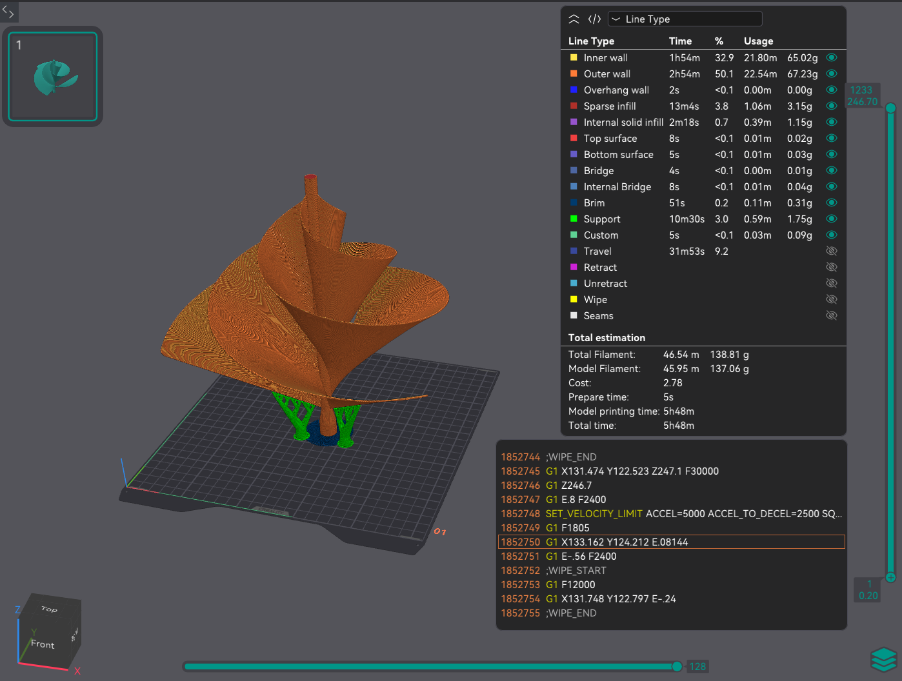
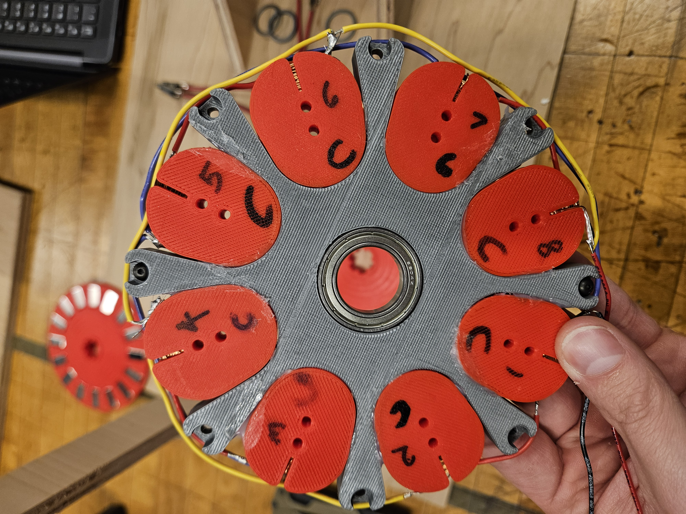

# Archimedes Sprial Wind Turbine

| Project Overview | Video of Wind Turbine |
|:----------------:|:---------------------:|
|Designed and constructed a novel small-scale wind turbine prototype optimized for turbulent urban wind conditions. The team selected an Archimedes spiral blade geometry due to its ability to capture multidirectional and unsteady airflow more effectively than traditional horizontal-axis turbines. The project focused on aerodynamic performance, structural feasibility, and experimental validation under simulated wind conditions. |  |

  

***

## Concept and Design

| <h2> CAD Model </h2> | <h2> CAD Design </h2> |
|:--:|:---|
|  | <ul> <li>Modeled sprial blade geometry</li>  <li>Selected materials</li>  <li>Constructed turbine assembly</li> </ul> |
| CAD Model Download -> |  |

***

## Fabrication

|  |  |
|:--:|:--:|
| Turbine Assembly | Orca Slice of Air Foil |

***

## Generator

We slightly modified a hand crank generator to convert the mechanical energy from the turbine to electrical power using magnets and copper wire

| Winding Groups | Stator Holding Magnets |
|:--:|:--:|
|  |  |

***

## Performance Testing

|  | Glimpse of the Testing Phase (Beginning)
|:--:|:---|
|Testing Parameters | <ul> <li>Voltage</li>  <li>Current</li>  <li>Speed</li> <li>Temperature</li></ul> |

***

## Engineering Skills Demonstrated

<ul>
<li> CAD modeling and assembly design in SolidWorks </li>
<li> Aerodynamic design consideration </li>
<li> Rapid Prototyping </li>
<li> Engineering design iteration </li>
<li> Experimental testing and evaluation </li>
</ul>

  
</ul>

