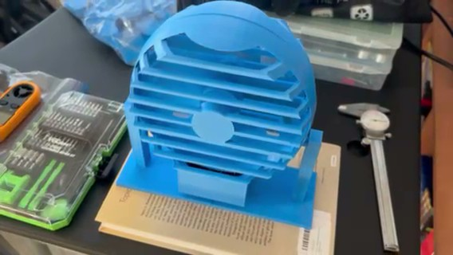
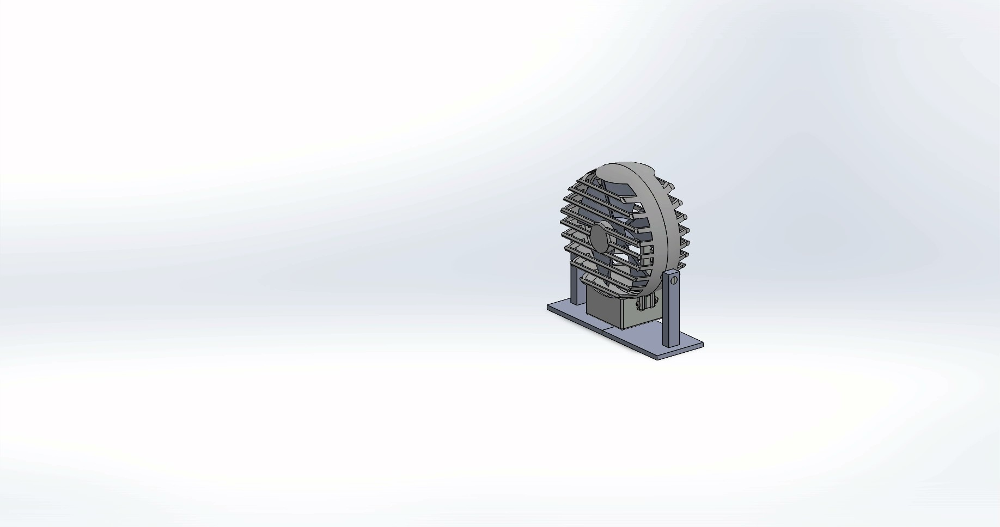
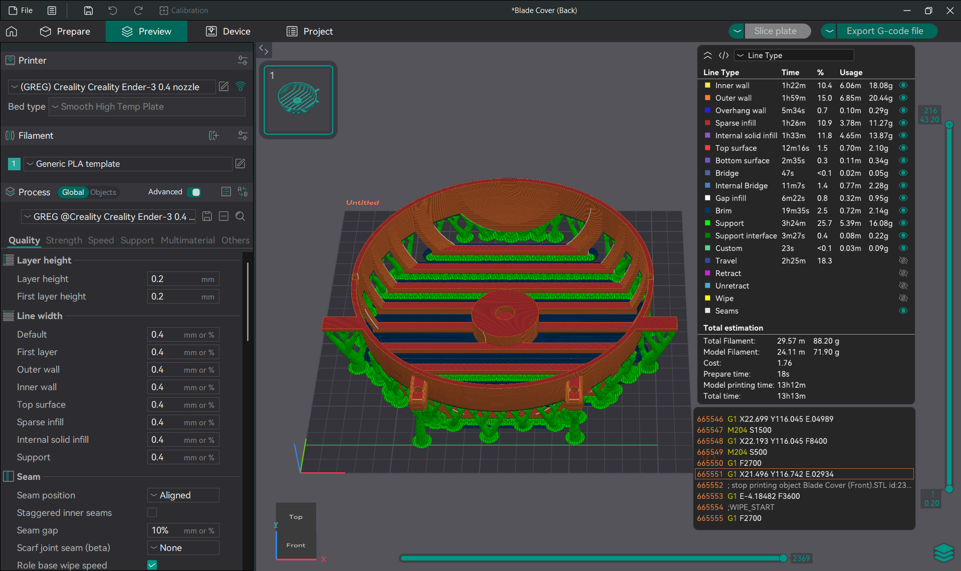
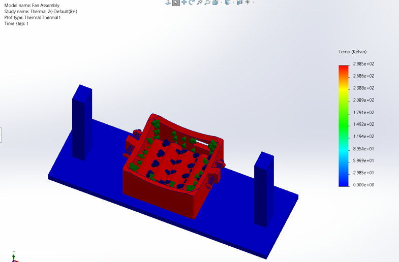
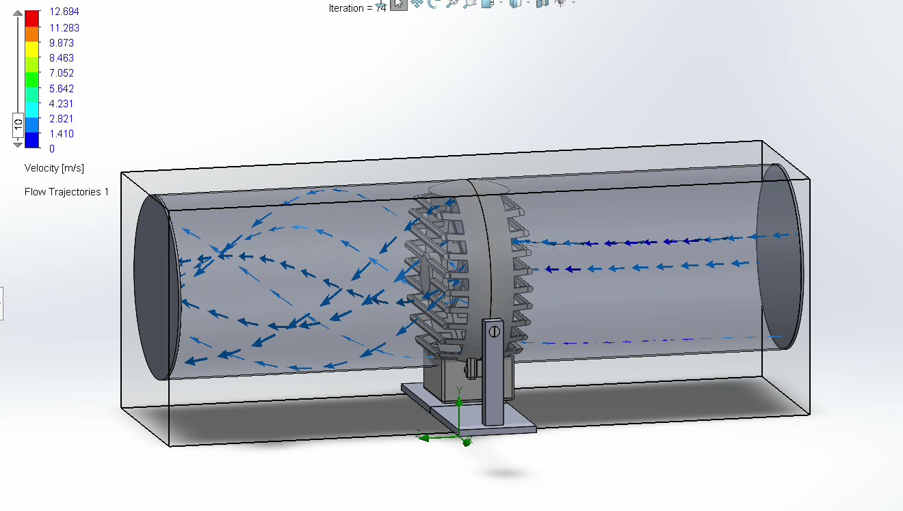

<table>
<tr>
<td align="center">
 
Lift System
</td>

<td align="center">
 
Auto Lift
</td>

<td align="center">
 
Force Diagram
</td>
</tr>
</table>

# Custom Fan Design and Thermal Analysis
| Project Overview | Final Product Video |
| :--------------: | :-----------------: |
| Designed and fabricated a fully functional electric fan, completing the project from CAD modeling through physical manufacturing and performance testing. The project included SolidWorks modeling, 3D printing, electrical soldering, and structural and thermal stress analysis to evaluate product durability and safety.  |  |
| Assembly Plan Download |  |
| Fan Design Report Download |  |
| Bill of Materials Download |  |

***

# Design and Development

| Assembly Exploded Video | Concept and CAD |
| :---------------------: | :-------------: |
|  | - Fully modeled assembly in SolidWorks - Designed housing, blade geometry, and mounting structure - Considered airflow direction and structural rigidity |
| SolidWorks Assembly Files | 

***

# Manufacturing / Fabrication

| Orca Sliced File Image | Manufacturing |
| :--------------------: | :-----------: |
|  | 3D printed structural components - Assembled motor and blade system - Soldered electrical connections | 
| SolidWorks Drawing Files |  |
| Orca Files |  |
| SLT Files |  |

***

Analysis and Testing

| Thermal Stress Test | Fluid Flow Simulation |
| :-----------------: | :-------------------: |
| 

 | 

 |

Thermal Analysis was performed to assess if the batteries would heat up with prolonged use.  SolidWorks Thermal Analysis showed there was not a significant thermal stress, and physical testing confirmed the results.  A Fluid Flow Simulation was performed using Flow Simulation in SolidWorks to determine whether there would be meaningful flow out of the fan to be able to cool someone.  The simulation showed there was sufficient flow out of the front of the fan.  

***

# Engineering Challenges

- Thermal build up was controlled by powering the fan with 4 AA batteries.
  
- With creating a small desktop fan, it was difficult to design for manufacturing to ensure all parts could be 3D printed and assembled.  

- It was also important to take precise measurements for CAD models to ensure tolerances were met when designing a part to stabilize / hold the blade and motor together to maintain stability and allow the motor to rotate while operating the fan.  

***

# Skills Used

3D CAD Modeling (SolidWorks)

Computational Fluid Dynamics – Flow Simulation (SolidWorks)

Thermal & Structural Stress Analysis (SolidWorks)

Design for Additive Manufacturing

Prototype Fabrication & Assembly
