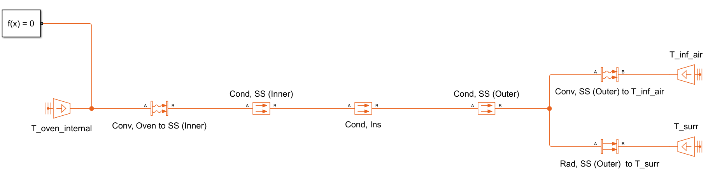
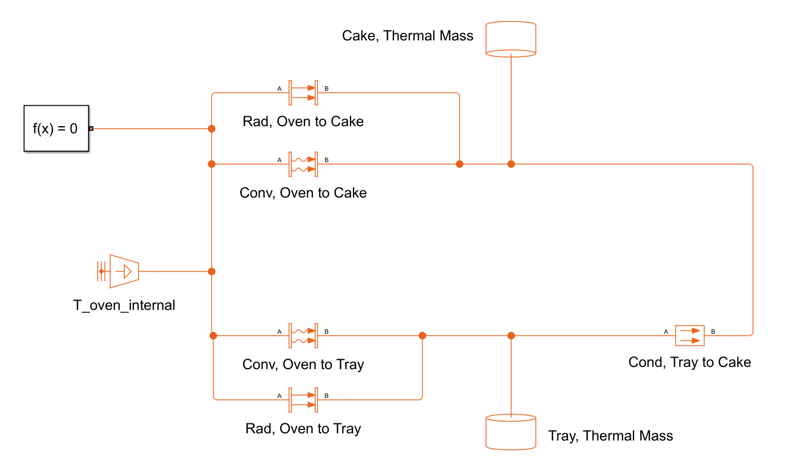
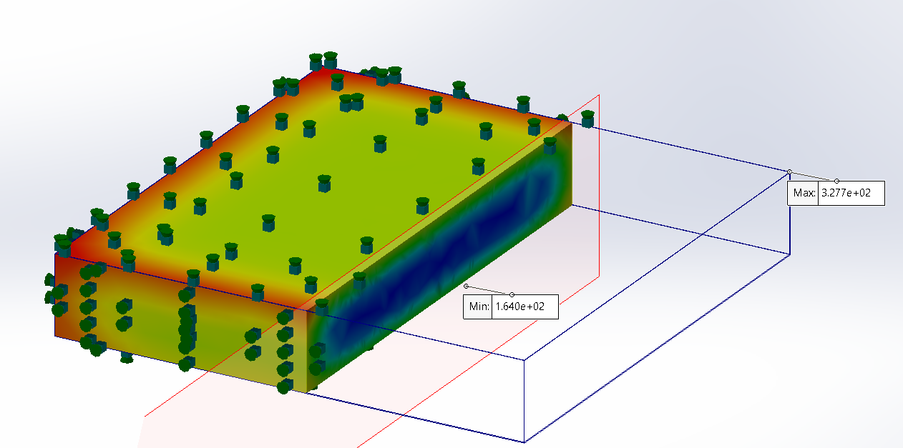

INSERT IMAGES ABOVE

***

  
  # Oven Thermal Design Study
  

| Project Overview | Images | File Download |
|:-----------------|:-------|:--------------|
| This project was based on a real engineering constraint where an industrial baking process required reduced cook time to meet production demand without purchasing additional ovens.  We first performed a steady-state thermal analysis of the oven at an internal operating temperature of 350°F, modeling heat loss through a thermal resistance network with various insulation configurations. The goal was to ensure that heat input exceeded losses to maintain stable operating conditions.|  |  |
| Next, we developed a transient lumped capacitance model in MATLAB to simulate the cooking process of a food item with thermally similar properties to chicken. This allowed estimation of internal temperature evolution and baseline cook time predictions.|  |  |
| Finally, the system was modeled in SolidWorks Thermal Simulation to capture spatial temperature gradients and geometric effects not included in simplified models. This step was used to evaluate design modifications aimed at reducing cook time and improving thermal efficiency, ultimately targeting reduced production bottlenecks and avoiding capital equipment expansion. |  |  |

***

  
  # Steady-State Thermal Analysis of Oven

  Steady-state MATLAB thermal model using a resistance network was used to evaluate oven heat loss at 350°F. A parametric sweep over insulation materials and thicknesses was performed, followed by a cost vs performance optimization to select the most efficient insulation design.

| Insulation Type | Thermal Conductivity, k (W/m·K) | Thickness (in) | Max Allowable Temp (°F) | Surface Temp (Simscape) (°C) | Surface Temp (MATLAB Hand Calc) | Rate of Heat Loss (W) |
|:---------------:|:-------------------------------:|:--------------:|:-----------------------:|:----------------------------:|:-------------------------------:|:---------------------:|
| Cellular Glass | 0.058 | 3 | 900 | 31.86 | 31.85 | 3,596.46 |
| Perlite, Expanded | 0.042 | 2 | 1200 | 32.71 | 32.70 | 3,860.09 |
| Calcium Silicate | 0.060 | 2 | 1200 | 32.20 | 32.19 | 3,702.66 |

| Insulation Type | Area Needed (ft²) | Thickness Needed (in) | Unit Price ($/ft² for required thickness) | Total Cost ($) |
|:---------------:|:-----------------:|:---------------------:|:-----------------------------------------:|:--------------:|
| Cellular Glass | 378 | 3 | ~15 | 5,670 |
| Perlite Expanded | 378 | 2  | ~4 | 1,512 |
| Calcium Silicate | 378 | 2 | ~6 | 2,268 |

Expanded perlite was selected as the optimal insulation due to its lowest cost while satisfying the minimum heat loss requirement of approximately 1200 W across all tested materials.

***

