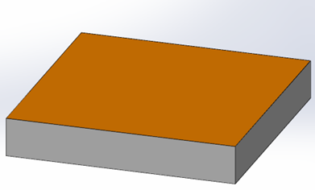
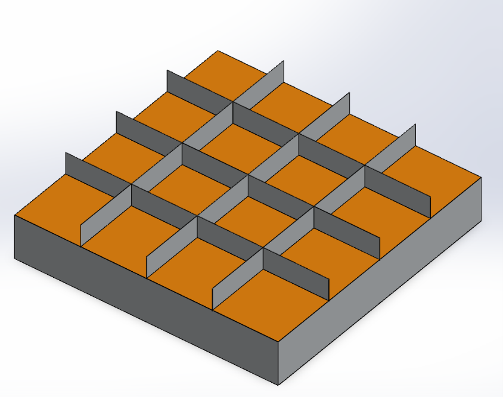
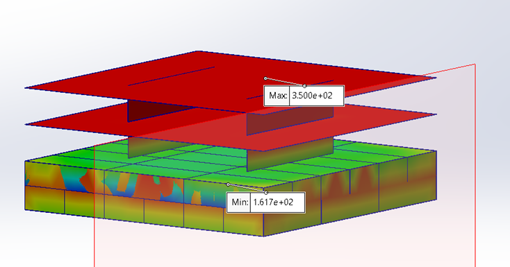
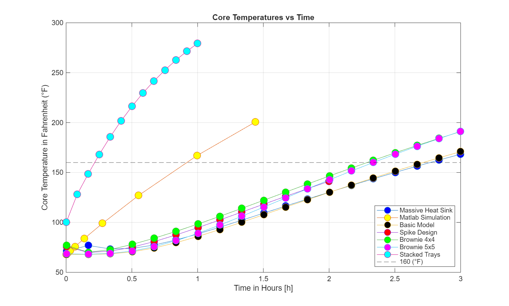
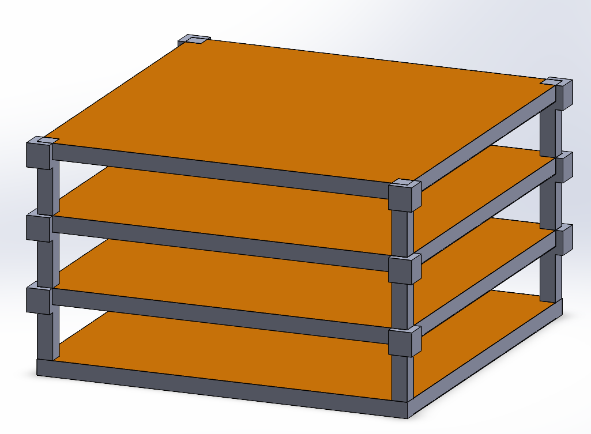

INSERT IMAGES ABOVE

***

  
  # Oven Thermal Design Study
  

| Project Overview | Images |
|:-----------------|:-------|
| This project was based on a real engineering constraint where an industrial baking process required reduced cook time to meet production demand without purchasing additional ovens.  We first performed a steady-state thermal analysis of the oven at an internal operating temperature of 350°F, modeling heat loss through a thermal resistance network with various insulation configurations. The goal was to ensure that heat input exceeded losses to maintain stable operating conditions.|  |
| Next, we developed a transient lumped capacitance model in MATLAB to simulate the cooking process of a food item with thermally similar properties to chicken. This allowed estimation of internal temperature evolution and baseline cook time predictions.|  |
| Finally, the system was modeled in SolidWorks Thermal Simulation to capture spatial temperature gradients and geometric effects not included in simplified models. This step was used to evaluate design modifications aimed at reducing cook time and improving thermal efficiency, ultimately targeting reduced production bottlenecks and avoiding capital equipment expansion. |  |

***

  
  # Steady-State Thermal Analysis of Oven

  Steady-state MATLAB thermal model using a resistance network was used to evaluate oven heat loss at 350°F. A parametric sweep over insulation materials and thicknesses was performed, followed by a cost vs performance optimization to select the most efficient insulation design.

| Insulation Type | Thermal Conductivity, k (W/m·K) | Thickness (in) | Max Allowable Temp (°F) | Surface Temp (Simscape) (°C) | Surface Temp (MATLAB Hand Calc) | Rate of Heat Loss (W) |
|:---------------:|:-------------------------------:|:--------------:|:-----------------------:|:----------------------------:|:-------------------------------:|:---------------------:|
| Cellular Glass | 0.058 | 3 | 900 | 31.86 | 31.85 | 3,596.46 |
| Perlite, Expanded | 0.042 | 2 | 1200 | 32.71 | 32.70 | 3,860.09 |
| Calcium Silicate | 0.060 | 2 | 1200 | 32.20 | 32.19 | 3,702.66 |

| Insulation Type | Area Needed (ft²) | Thickness Needed (in) | Unit Price ($/ft² for required thickness) | Total Cost ($) |
|:---------------:|:-----------------:|:---------------------:|:-----------------------------------------:|:--------------:|
| Cellular Glass | 378 | 3 | ~15 | 5,670 |
| Perlite Expanded | 378 | 2  | ~4 | 1,512 |
| Calcium Silicate | 378 | 2 | ~6 | 2,268 |

Expanded perlite was selected as the optimal insulation due to its lowest cost while satisfying the minimum heat loss requirement of approximately 1200 W across all tested materials.

***

# Transient Thermal Model (Lumped Capacitance – MATLAB/Simulink)

A transient lumped capacitance model was implemented in MATLAB/Simulink to simulate the cooking of a chicken-like thermal mass. Cook time and temperature evolution were predicted under convective, radiative, and conductive heating conditions. The validity of the lumped assumption was verified using the Biot number criterion (Bi < 0.1).  

## Parameters Used for Transient Analysis

| Block | Temp (°F) | Area (in²) | Heat Transfer Coefficient, h (W/m²·K) | Thickness (in) | Thermal Conductivity, k (W/m·K) | Radiation Coefficient, εσ (W/m²·K⁴) | Mass (kg) | Specific Heat, c (J/kg·K) |
|:-----:|:---------:|:----------:|:-------------------------------------:|:--------------:|:-------------------------------:|:-----------------------------------:|:--------:|:-------------------------:|
| T_oven_internal   | 350       | --          | --                                     | --             | --                               | --                                   | --       | --                        |
| Rad, Oven to Cake | --        | 576         | --                                     | --             | --                               | 0.95 * 5.67e-8                       | --       | --                        |
| Conv, Oven to Cake| --        | 576         | 10                                     | --             | --                               | --                                   | --       | --                        |
| Rad, Oven to Tray | --        | 965.6135    | --                                     | --             | --                               | 0.3 * 5.67e-8                        | --       | --                        |
| Conv, Oven to Tray| --        | 965.6135    | 10                                     | --             | --                               | --                                   | --       | --                        |
| Cond, Tray to Cake| --        | 578.4025    | --                                     | 0.025          | 16.6                             | --                                   | --       | --                        |
| Cake Thermal Mass | 68        | --          | --                                     | --             | --                               | --                                   | 39.644   | 3560                      |
| Tray Thermal Mass | 68        | --          | --                                     | --             | --                               | --                                   | 3.156    | 512                       |

The cake reached 160°F in ~55 minutes. The Biot number (1.281 > 0.1) indicated that internal temperature gradients were significant, violating the lumped capacitance assumption and limiting the accuracy of the model. This motivated a transition to 3D SolidWorks thermal simulation to capture spatial temperature variations. 

***
# Thermal Design Optimization (SolidWorks FEA)

Following the thermal analysis of the baseline cake-and-tray system, a design optimization study was conducted to reduce overall cooking time. Multiple tray geometries were evaluated in SolidWorks thermal simulations to modify heat transfer pathways and improve thermal response. The objective was to identify a configuration that minimized cook time while maintaining uniform heating of the product.

## Original and Improved Models

<table>
<tr>
<td align="center">
 
Original Model
</td>

<td align="center">
 
Brownie Design
</td>

<td align="center">
 
Heat Sink Design
</td>
</tr>
<tr>
<td>

Original Model (Baseline) to compare cook time

</td>
<td>

Brownie Design (Reduce space between sections not being heated by conduction)

</td>
<td>

Heat Sink Design (A larger Surface Area would lead to more heat being transfered through conduction)

</td>
</tr>
</table>

|  |  |
|:----:|:---:|
| Heat Curve for all Designs | Final Stacked Tray Design |

# Key Engineering Takeaways

* The Biot number is critical for validating modeling assumptions; applying a lumped capacitance model when Bi > 0.1 leads to significant inaccuracy due to internal temperature gradients.
* The lumped capacitance model in MATLAB predicted a cook time of approximately 55 minutes, whereas SolidWorks FEA showed the same system required ~2.8 hours for the internal temperature to reach 160°F, highlighting the limitations of simplified models.
* Incorporating stainless steel dividers (brownie-style design) did not significantly reduce cook time, as the individual sections remained too thick for efficient heat transfer.
* The heat sink-inspired design, intended to increase surface area and enhance heat absorption, instead increased cook time due to the added thermal mass, which required additional energy and time to heat.
* The stacked layer design proved most effective by reducing the characteristic thickness of each layer, allowing convection and radiation to heat the product more efficiently. This design also offered a simpler and more feasible manufacturing approach.

***

# Engineering Tools and Methods

* MATLAB / Simulink
  * Transient thermal modeling using lumped capacitance methods and parametric analysis
* SolidWorks Simulation (Thermal FEA)
  * 3D transient heat transfer modeling including conduction, convection, and radiation
* Analytical Heat Transfer Methods
  * Steady-state thermal resistance networks and Biot number validation
* Design Optimization Techniques
  * Geometry-based performance improvement and comparative analysis of multiple design configurations

